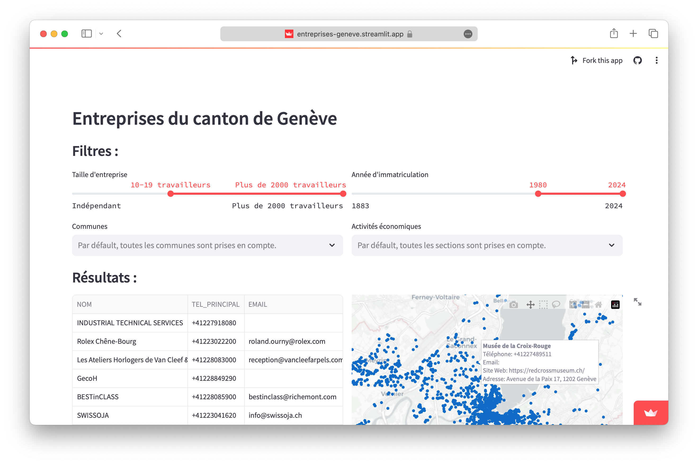

# Geneva's REG research

## Table of Contents

- [Overview](#overview)
- [Usage](#usage)
- [Installation](#installation)
- [Dependencies](#dependencies)
- [Files](#files)
- [External Help links](#external-help-links)
- [License](#license)

## Overview

[Geneva's REG research](https://entreprises-geneve.streamlit.app) is a web application that allows users to conduct research on companies established in the canton of Geneva.



## Usage

The filters enable users to refine their search results based on:
- Company size
- Year of registration
- Municipality
- Economic activities
- Industry sectors

The search results can be exported as a CSV file and visualized on the map of Geneva.

## Installation 

On Mac, open the terminal and type:
```shell
cd
```
Drag the **`folder`** containing the file `streamlit_app.py`, then press the Enter key (↩︎).

_If you have done it correctly, the **`~`** between your machine's name (`name@MacBook-Pro-of-Name`) and the **`%`** sign should display the name of the `folder` instead._

Execute the following line of code by pressing the Enter key (↩︎):
```shell
streamlit run streamlit_app.py
```
Wait a moment, the web application should open in your default web browser.

## Dependencies

- The project is implemented in `Python 3.11.6`.
- The `requirements.txt` file is build for Streamlit Cloud, follow these instructions on your machine :
```shell
pip install numpy pandas plotly==5.18.0 streamlit
```

## Files

- `streamlit_app.py` : The web application
- `requirements.txt`: The libraries required for the script.
- Sources\\`companies.ipynb`: The script for clear the dataset and convert locations.

## External Help links

* [Répertoire des entreprises du canton de Genève (REG)](https://ge.ch/sitg/fiche/2099)
* [Nomenclature générale des activités économiques (NOGA)](https://www.bfs.admin.ch/bfs/fr/home/statistiques/industrie-services/nomenclatures/noga.assetdetail.344103.html)
* [NAVREF](https://www.swisstopo.admin.ch/fr/conversion-coordonnees-navref)

## License

MIT License

Copyright (c) [2024] [Gauthier Rammault]